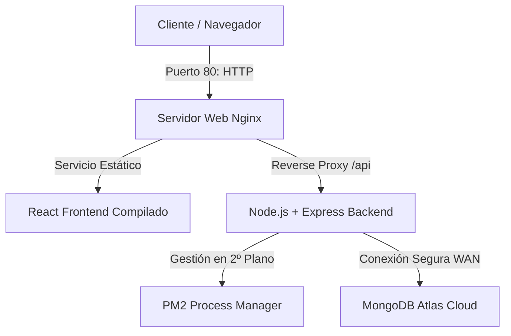

# Manual de Despliegue en Producción (Debian 13 LXC)
**Proyecto Intermodular: CafES App**  
**Autores: Isaac y Jose Daniel (Grupo 3 - 2DAM)**  
**Contenedor ID: 3102**

Este manual documenta de forma exhaustiva el procedimiento paso a paso para desplegar la aplicación **CafES App** desde una instalación limpia de **Debian 13** en un contenedor LXC gestionado por Proxmox.

---

## 🏛️ Arquitectura de Despliegue en Producción

Para garantizar un rendimiento y estabilidad de nivel profesional, se ha implementado la siguiente arquitectura de software dentro del contenedor:



### Componentes Utilizados:
1. **Nginx**: Actúa como servidor web de alto rendimiento para servir los archivos estáticos de React (HTML, CSS, JS) y como **Reverse Proxy** para redirigir de forma transparente las peticiones de `/api/*` al servidor backend en Node.js.
2. **Node.js (LTS v18)**: Motor de ejecución para el servidor de la API REST del backend.
3. **PM2**: Administrador de procesos de producción para Node.js. Se encarga de mantener el backend ejecutándose de forma continua en segundo plano, reiniciarlo automáticamente si falla y asegurar su autoarranque en el inicio del sistema.
4. **MongoDB Atlas**: Base de datos en la nube. Conectar el contenedor a Atlas nos permite ahorrar memoria RAM y almacenamiento del contenedor, asegurando respuestas más veloces.

---

## 🛠️ Procedimiento de Instalación Paso a Paso

Siga estos pasos introduciendo los comandos en la pestaña **Console** de su contenedor LXC en Proxmox (con el usuario administrador `root`).

### Paso 1: Actualizar el Sistema e Instalar Utilidades de Compilación
Dado que el backend utiliza la librería `escpos` para la comunicación con la impresora local (la cual incluye módulos nativos de C++ que deben compilarse en Linux), es indispensable instalar las herramientas esenciales de desarrollo (`build-essential`) y las cabeceras de puertos del sistema (`libudev-dev`).

```bash
# Actualizar los repositorios e índices de paquetes de Debian 13
apt update && apt upgrade -y

# Instalar Git, Curl y herramientas de compilación nativa en C++
apt install -y git curl build-essential libudev-dev
```

---

### Paso 2: Instalar Node.js y npm (Versión LTS Estable)
Instalaremos Node.js v18 (LTS) utilizando el repositorio oficial de NodeSource para asegurar la máxima estabilidad de la aplicación y la compatibilidad de las librerías nativas.

```bash
# Agregar el repositorio de NodeSource para Node.js 18
curl -fsSL https://deb.nodesource.com/setup_18.x | bash -

# Instalar Node.js y NPM
apt install -y nodejs

apt install -y npm

# Verificar las versiones instaladas
node -v
npm -v
```

---

### Paso 3: Clonar el Código Fuente de la Aplicación
Organizaremos el proyecto en el directorio estándar `/var/www` dedicado a aplicaciones web en servidores Linux.

```bash
# Crear el directorio base e ingresar
mkdir -p /var/www
cd /var/www

# Clonar el repositorio oficial desde GitHub
git clone https://github.com/Josed755/Proyecto_intermodular.git cafesapp

# Acceder al directorio clonado
cd cafesapp
```

---

### Paso 4: Despliegue y Configuración del Backend (Node.js)

1. **Instalar dependencias del Backend**:
   ```bash
   cd /var/www/cafesapp/backend
   npm install
   ```

2. **Configurar Variables de Entorno en Producción**:
   Creamos el archivo `.env` para almacenar de forma segura las credenciales de la base de datos de producción y Stripe.
   ```bash
   nano .env
   ```
   Pega el siguiente contenido (utilizando la nueva cuenta de MongoDB Atlas migrada):
   ```env
   MONGODB_URI=mongodb+srv://<usuario>:<contraseña>@cluster0.xxxxxx.mongodb.net/cafesapp?retryWrites=true&w=majority
   JWT_SECRET=tu_clave_secreta_jwt
   PRINTER_IP=192.168.30.10
   PORT=5000
   STRIPE_SECRET_KEY=sk_test_tu_clave_secreta_stripe_aqui
   ```
   *Guarda y cierra pulsando `Ctrl+O`, `Enter` y `Ctrl+X`.*

3. **Configurar el Administrador de Procesos (PM2)**:
   Para que el backend corra en segundo plano de manera profesional:
   ```bash
   # Instalar PM2 de forma global en el sistema
   npm install -g pm2

   # Arrancar la API del backend
   pm2 start server.js --name "cafes-backend"

   # Habilitar el inicio automático al arrancar el contenedor
   pm2 startup
   ```
   *Nota: El comando `pm2 startup` imprimirá una línea de código específica en pantalla. Cópiala y ejecútala en la terminal.*
   
   Finalmente, guarda la lista de procesos activos:
   ```bash
   pm2 save
   ```

---

### Paso 5: Despliegue y Compilación del Frontend (React)

1. **Instalar dependencias del Frontend**:
   ```bash
   cd /var/www/cafesapp/frontend
   npm install
   ```

2. **Configurar la API y variables estáticas**:
   El frontend ahora utiliza una ruta relativa (`/api/`) gracias al proxy inverso de Nginx, eliminando la necesidad de hardcodear URLs en el código.
   ```bash
   nano .env
   ```
   Pega la clave de Stripe del frontend:
   ```env
   REACT_APP_STRIPE_PUBLISHABLE_KEY=pk_test_tu_clave_publica_stripe_aqui
   ```

3. **Compilar para Producción**:
   Generamos los archivos estáticos listos para ser servidos por el servidor web optimizado:
   ```bash
   npm run build
   ```
   *Esto generará una carpeta super optimizada en `/var/www/cafesapp/frontend/build`.*

---

### Paso 6: Instalación y Configuración del Servidor Web Nginx

Nginx se encargará de recibir todas las peticiones públicas HTTP, servir la interfaz React y delegar las solicitudes API al backend local.

1. **Instalar Nginx**:
   ```bash
   apt install -y nginx
   ```

2. **Crear archivo de configuración del sitio**:
   ```bash
   nano /etc/nginx/sites-available/cafesapp
   ```
   Introduce el siguiente bloque de configuración optimizado para Single Page Applications (React Router) y Node.js proxying:
   ```nginx
   server {
       listen 80;
       server_name localhost; # O el dominio/IP asignado a tu contenedor

       # 1. SERVIR EL FRONTEND DE REACT
       location / {
           root /var/www/cafesapp/frontend/build;
           index index.html index.htm;
           try_files $uri $uri/ /index.html; # Soluciona el error 404 al recargar páginas internas
       }

       # 2. REVERSE PROXY PARA LA API REST DEL BACKEND
       location /api/ {
           proxy_pass http://127.0.0.1:5000/api/;
           proxy_http_version 1.1;
           proxy_set_header Upgrade $http_upgrade;
           proxy_set_header Connection 'upgrade';
           proxy_set_header Host $host;
           proxy_cache_bypass $http_upgrade;
       }
   }
   ```

3. **Habilitar el nuevo sitio y desactivar el por defecto**:
   ```bash
   # Enlazar la configuración para activarla
   ln -s /etc/nginx/sites-available/cafesapp /etc/nginx/sites-enabled/

   # Eliminar el sitio por defecto de Nginx
   rm /etc/nginx/sites-enabled/default

   # Validar que no existan errores de sintaxis
   nginx -t
   ```

4. **Reiniciar Nginx**:
   ```bash
   systemctl restart nginx
   ```

---

## 🔒 Solicitud de Apertura de Puertos (Red y Router)

Dado que Nginx está unificando y orquestando de manera transparente tanto el Frontend como el Backend bajo una misma conexión, **únicamente necesitamos exponer un único puerto estándar**:

* **Puerto Solicitado**: **80** (HTTP)
* **Destino Interno**: Puerto `80` del contenedor con **ID 3102** (IP Privada: `192.168.40.33`)
* **Justificación**: Permitir el acceso web público a la aplicación completa (interfaz de usuario de pedidos, panel de administración y comunicación API unificada).

### 🌐 Mecanismo de Red y Direccionamiento (LAN vs WAN)
* **Acceso desde la LAN (Red Interna)**: Actualmente, la aplicación está escuchando y disponible de forma activa en la IP privada **`192.168.40.33`** en el puerto `80`. Cualquier dispositivo conectado a la red local (WiFi o cable) del instituto puede acceder directamente a ella a través de esta dirección IP.
* **Acceso desde la WAN (Red Externa / Desde Casa)**: Para permitir que los usuarios (clientes y administradores) accedan a la aplicación desde fuera de la infraestructura del centro educativo, se requiere configurar una regla de **NAT / Port Forwarding** en el router perimetral del instituto. Esta regla mapeará un puerto externo disponible del dominio público **`proyectos2dam.duckdns.org`** (por ejemplo: `proyectos2dam.duckdns.org:<PUERTO_ASIGNADO>`) y redirigirá de forma transparente el tráfico hacia la IP privada interna **`192.168.40.33`** al puerto **`80`** de nuestro contenedor LXC.

---

## 📈 Comandos Útiles de Monitorización y Mantenimiento

Una vez desplegado el sistema, estos comandos permiten administrar la producción desde la consola:

* **Ver el estado de la API (Backend)**: `pm2 status`
* **Ver logs en tiempo real (peticiones y errores)**: `pm2 logs`
* **Reiniciar el backend**: `pm2 restart cafes-backend`
* **Ver estado de Nginx**: `systemctl status nginx`
* **Reiniciar Nginx**: `systemctl restart nginx`
